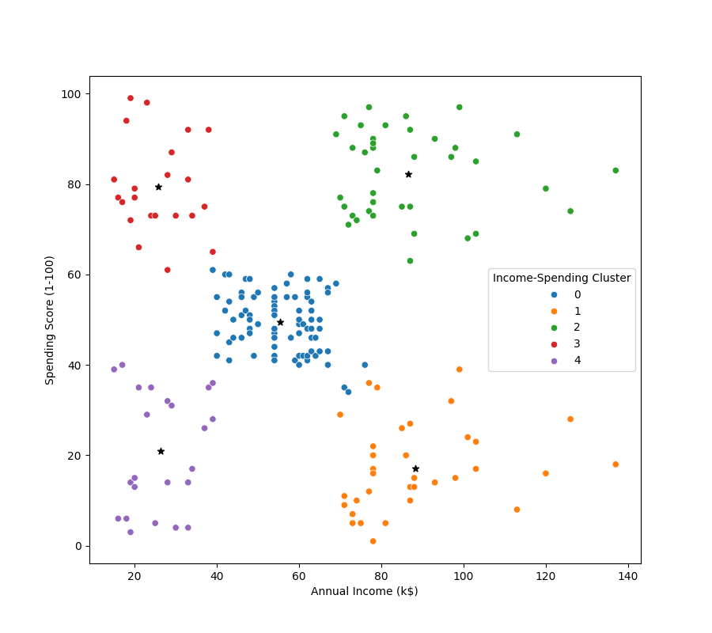

# Mall-Customer-Segmentation
Mall customers segmentation is done according the mall spending score and income of the customers. Analysis performed using Python (pandas, numpy, matplotlib and algos like KMeans) in Jupyter Notebook. Exported useful clustering dataframe as a csv.

